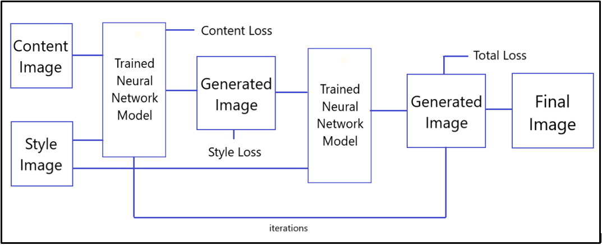

## Style Transfer onto Real-time Images

To perform Image Style Transfer onto Real-time captured images upon performing Smile Detection.

### Smile Detection

The Smile Detection is done in 2 parts:

1) we use the face_classifier which is an object loaded with haarcascade_frontalface_default.xml, we are using an inbuilt function with it called the detectMultiScale. This function helps find the features/locations of the new image. It will use all the features from the face_classifier object to detect the features of the new image.

2) we use smile_cascade, which is an object loaded with haarcascade_smile.xml, to look for smiles in the detected face.

### Neural Style Transfer

<div align='center'>

</div>

#### 1. Content Image and Style Image
The content image is loaded using API from the local system (saved after performing smile detection) and style image is taken using '' API from net.

<div align='center'>

</div>

#### 2. Selection of Intermediate layers for style and content images
The Content function should use the activations (feature maps) of the upper layers of a CNN (though one layer) because local image features are captured in the lower layers while global features are captured in the upper layers in CNNs.
The Style function should use features from multiple layers in a CNN because style is represented at all spatial scales. 
Here, we have used VGG-19 Pretrained network.

```
content_layers = ['block5_conv2'] 
style_layers = ['block1_conv1', 'block2_conv1', 'block3_conv1', 'block4_conv1', 'block5_conv1']
```

#### 3. Calculate Style
The content of an image is represented by the values of the intermediate feature maps. It turns out, the style of an image can be described by the means and correlations across the different feature maps. We calculate a Gram matrix that includes this information by taking the outer product of the feature vector with itself at each location, and averaging that outer product over all locations. This can be implemented concisely using the tf.linalg.einsum function

#### 4. Optimisation I (Adam's Optimiser) and Optimisation II (Specific Total Variation Weight)

<div align="center">

</div>

#### 5. Using Fast Style Transfer (Tensorflow)

<div align='center'>

</div>

### Steps of Code Execution
If you have VSCode or any Python Editor (supporting Jupyter):
1. Open the Capture.py file and save the image to the path (line 19)
```
path = r'path\img'+str(cnt)+'.jpg'
```
2. Open the Style_Transfer_Main.ipynb (Jupyter notebook) and add the path of downloaded image into content_path
```
content_path = tf.keras.preprocessing.image.load_img('path\img1.jpg')
```

### References
- https://github.com/tensorflow/docs/blob/master/site/en/tutorials/generative/style_transfer.ipynb
